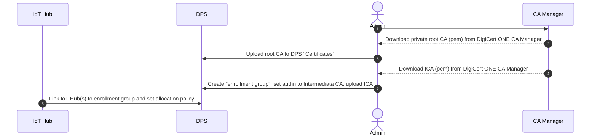
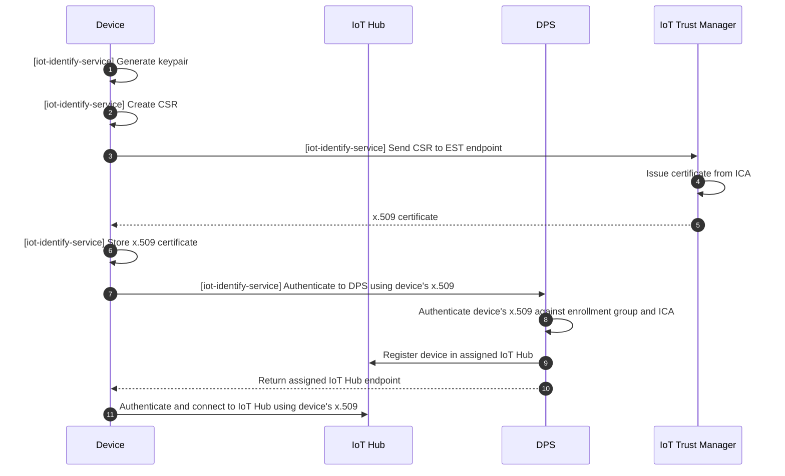

# Birth certificate flows using IoT Hub, DPS and iot-identity-service

The following flows requires NO changes to a customer's current Microsoft Azure IoT tech stack. This flow replaces self-signed certificates with certificates issued from a private CA heirarchy running on DigiCert ONE.

References:
- https://learn.microsoft.com/en-us/azure/iot-dps/about-iot-dps
https://learn.microsoft.com/en-us/azure/iot-dps/tutorial-custom-hsm-enrollment-group-x509?pivots=programming-language-ansi-c
- https://learn.microsoft.com/en-us/azure/iot-hub/authenticate-authorize-x509#authenticate-devices-signed-with-x509-ca-certificates
- https://azure.github.io/iot-identity-service/
- https://github.com/Azure/iotedge/blob/main/edgelet/doc/est.md

## Flow: Setup

Preconditions 
- Customer has a root CA and one or more intermediate CAs (ICA) have already been created in DigiCert ONE CA Manager.
- DPS and IoT Hub instances created in Azure. The flow below uses an enrollment group. Individual enrollments could be also be used.

## Flow: Device identity certificate issuance using iot-identify-service and EST

Prerequisites 
- iot-identify-service Certificates Service and Keys Service configured and running
- A DigiCert ONE IoT Trust Manager enrollment profile is configured for EST server and uses the ICA to issue device identity certificates

## Flow: Alternative device identity certificate issuance flows

As an alternative to the above EST flow using iot-identify-service, the following options are available:

- Single or batch certificate issuance using IoT Trust Manager REST, SCEP, ACME, CMPv2 APIs
- Integration with on-premise manufacturing systems, where these systems request and receive certificates and then provision these to the devices.
- Certs and keys issued using these alternative methods could be utilized by iot-identify-service to provision the device to DPS and authenticate with IoT Hub.